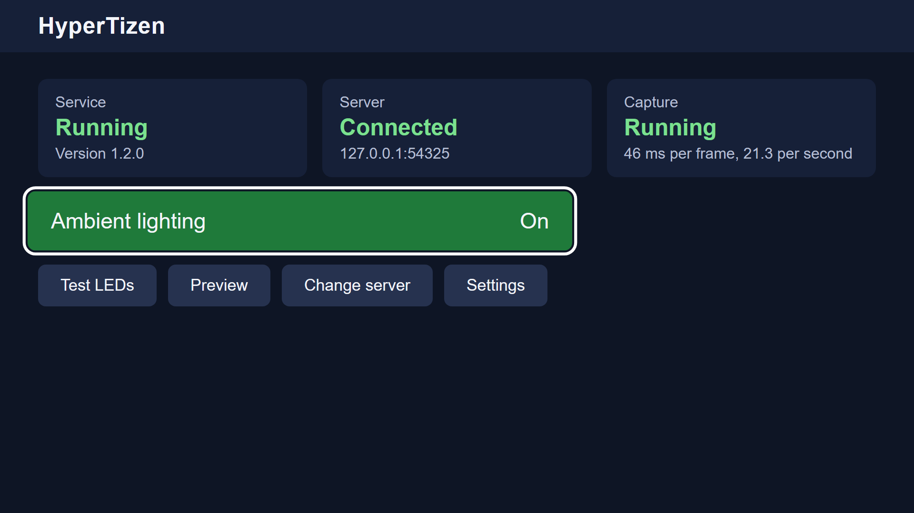
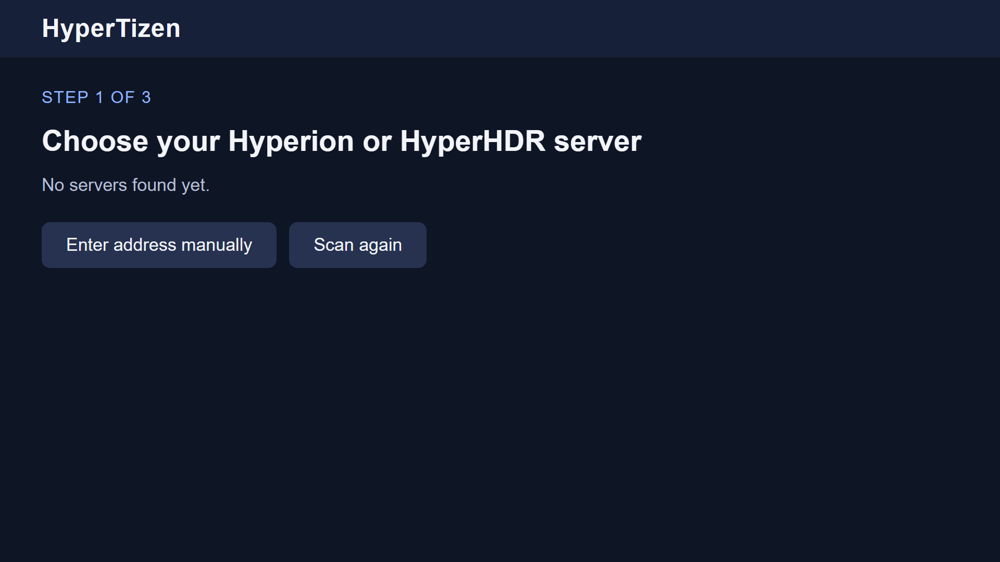
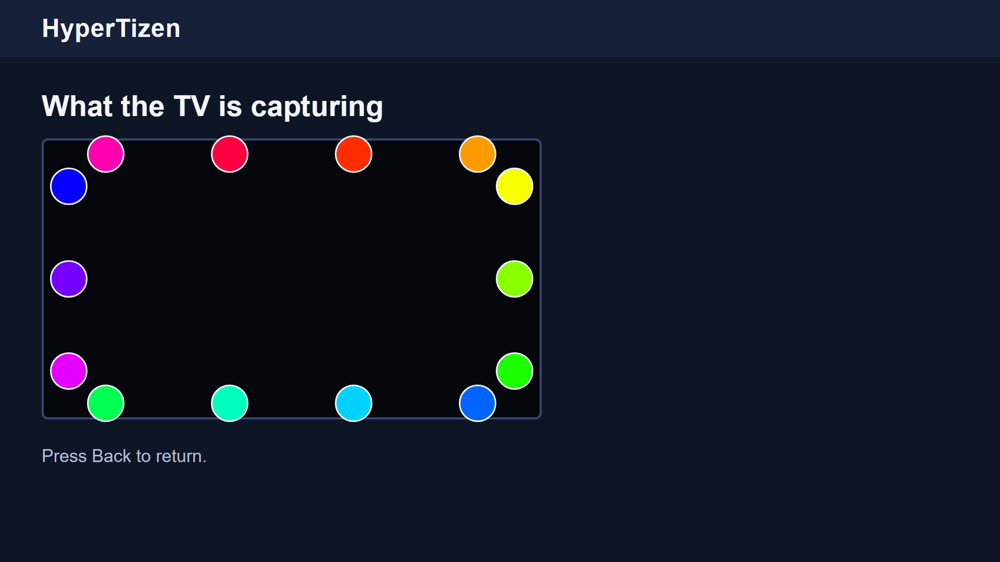
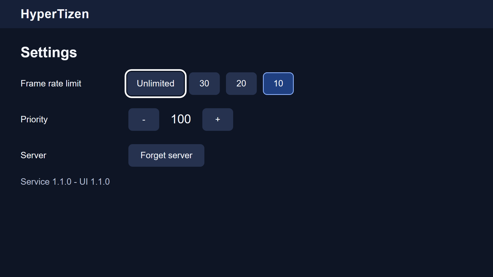

# HyperTizen

### Color up your Tizen TV with HyperTizen!
HyperTizen is a Hyperion / HyperHDR capturer for Tizen TVs. It reads the colors at the edges of the picture on the TV itself and sends them to your Hyperion or HyperHDR server, which drives the LEDs behind the screen.

This repository is a fork of [reisxd/HyperTizen](https://github.com/reisxd/HyperTizen), the project it started from. The capture idea, the TV service and the TizenBrew module are that project's work; this fork adds a guided setup on the TV, a way to run and test everything on a PC, and support for newer TVs.

    

# What this fork adds

- **Guided setup on the TV.** Three steps with the remote: choose your server (found on the network, or typed in), check that the LEDs light up, turn it on.
- **A Home screen that says what is happening.** Service, server and capture each show their state, with the last error when something is wrong.
- **Preview.** See the colors the TV is capturing, placed where they are measured on the screen.
- **Settings.** Frame rate limit (any value up to 60), Hyperion priority, and forgetting the server.
- **Capture zones you choose.** Set how many zones the top, bottom, left and right edge have: fewer for faster updates, more for finer color, none for an edge without LEDs. The TV shows how long a frame takes with your choice.
- **Capture on newer TVs**, and 10-bit colors scaled correctly.
- **Reconnecting.** The service finds its server again after either side restarts.
- **Run it on your PC.** A desktop host runs the same service logic with simulated colors and serves the TV UI in a browser, so most work needs no TV.
- **Tests** for the service logic and the UI, and scripts that build, sign and install on a TV in one step.

<table>
  <tr>
    <td width="50%"></td>
    <td width="50%"></td>
  </tr>
  <tr>
    <td align="center">Setup, step 1 of 3</td>
    <td align="center">Preview of the captured colors</td>
  </tr>
  <tr>
    <td width="50%"></td>
    <td width="50%"></td>
  </tr>
  <tr>
    <td align="center">Settings</td>
    <td align="center">Home</td>
  </tr>
</table>

The screenshots are from the desktop host, which shows a simulated rainbow in place of the TV picture.

# Getting Started

Read the [guide](./docs/README.md) to install HyperTizen on a TV, or to build and run it yourself.

# The original project

HyperTizen was created by [Reis Can](https://github.com/reisxd), who also makes [TizenBrew](https://github.com/reisxd/TizenBrew). The links below are that project's community:

    <a href="https://discord.gg/m2P7v8Y2qR">
       <picture>
           <source height="24px" media="(prefers-color-scheme: dark)" srcset="https://user-images.githubusercontent.com/13122796/178032563-d4e084b7-244e-4358-af50-26bde6dd4996.png" />
           
       </picture>
       </a>
       <a href="https://www.youtube.com/@tizenbrew">
      <picture>
         <source height="24px" media="(prefers-color-scheme: dark)" srcset="https://user-images.githubusercontent.com/13122796/178032714-c51c7492-0666-44ac-99c2-f003a695ab50.png" />
         
     </picture>
     </a>

